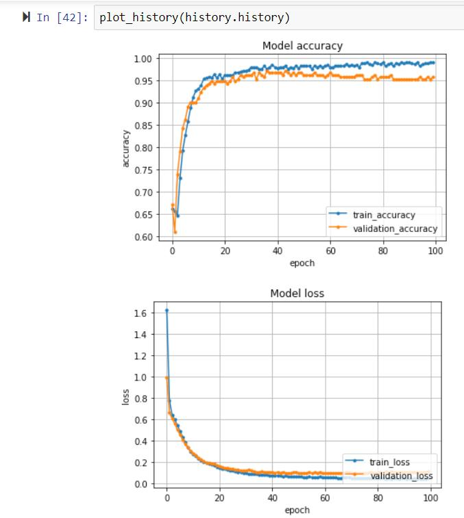
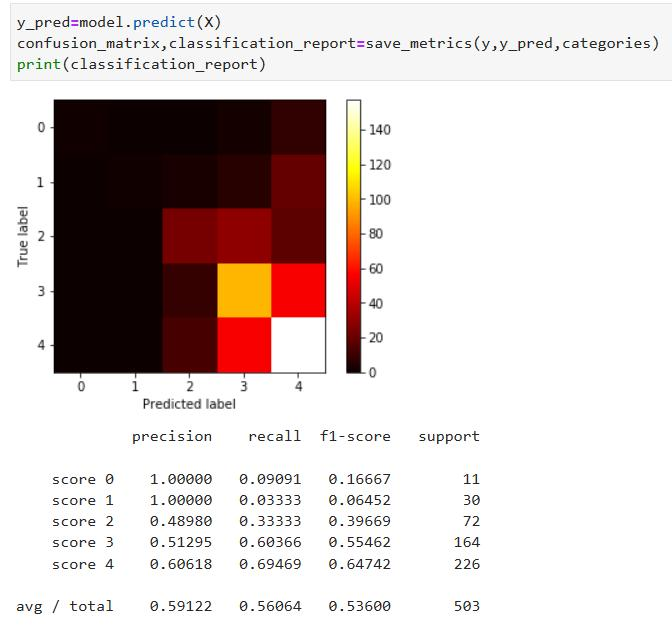

# summer-intern-project

The Project Consists of two Parts 

## Part 1:

### Task:
1. Build a model to predict scores of any new reviewer, where features of reviewers and hotels are
Given.
2. Identify the most relevant features in the model
Build a model to predict scores of any new reviewer, where features of reviewers and hotels are given.

### Results:

## Part 2:

1. Build a classifier to identify patients with benign or malignant tumour based on the tumour characteristics 
2. Its false positives and negatives and improving the model 

### Results:

